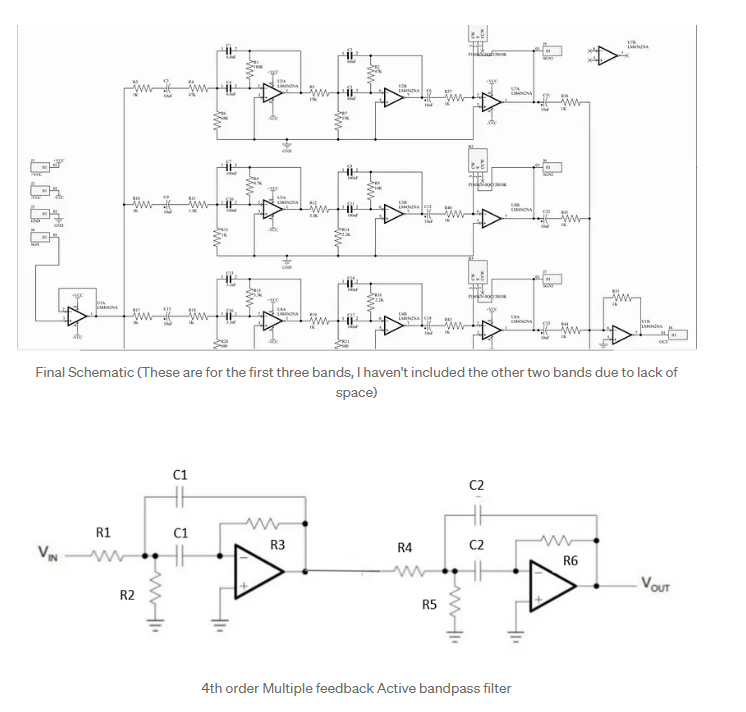
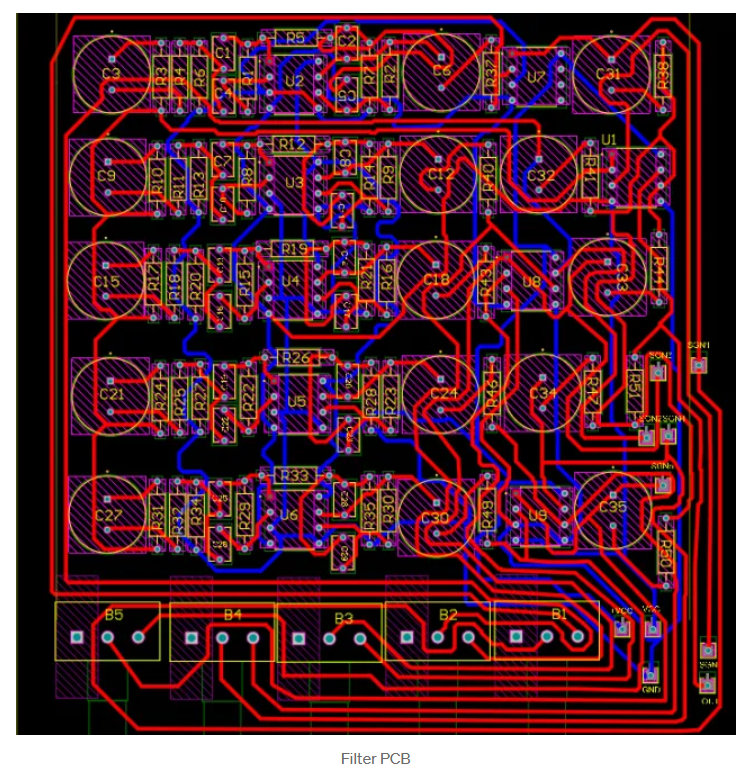

# Five Band Audio Equalizer
This Repository contains some brief information about designing a 5 - Band Audio Equalizer which was done by myself along with my fellow colleagues as a part of completion of EN 2091 Laboratory Practices Module in Department of Electronic and Telecommunication, University of Moratuwa, Sri Lanka.

## Introduction
An Equalizer is a device which has the ability to adjust the output of the different frequency bands for a given signal. These are widely used in Hi-Fi audio systems to get superior sound quality . We were asked to design a five Band Audio equalizer by only using analogue electronic components. In addition there were some tasks or like features that should be present in our Equalizer.

  

Such like our device should be capable of manipulating gains of frequencies in following frequency bands.
  1. 20 Hz to 300 Hz
  2. 300 Hz to 1000 Hz
  3. 1 KHz to 4 KHz
  4. 4 KHz to 10 KHz
  5. 10 KHz to 20 KHz
     
And also after separating the respective frequency bands our device must be capable of providing a custom gain for each band and also provide a user interface of showcasing the gains of each frequency bands. So in this article I’m going to take you a ride from scratch to a fully functioning Five Band Equalizer.

## Planning and Schematic Design
So initially there were many thoughts in our heads. As there were 3 more members in my team each of us had different ideas. So we brainstormed seeking for the start of our design. We had many choices as what types of filters we can use : Active filters? or else Passive Filters? What should be the order of the filters? what are the other parameters we should consider? How can we implement them what about user interface and Power supply ? How can we control the gain of each frequency Band? For all of our questions we found solutions.

We finally decided to use active filters as passive filters deals with inductors it may complex our design. Moreover these filters are not robust as their centre and cut-off frequencies change over time. So we planned to omit those filters and we focused on Active filters. Similarly after choosing Active filters there were so many kind of filters available (Such like Sallen-Key , Multiple Feedback). Anyhow we should filter the frequencies from 20 Hz to 20 KHz into 5 bands. So for that we need a filter with higher roll off. Consequently we should increase the order of the filter. But on the other hand if we increase the order of the filter our circuit may get too complex and our required output might not be attained due to that complexity. At last we narrow downed our choices as we were decided to use 4th order filter by cascading 2 Multiple Feedback filters.

After deciding the filters we looked after for the other supplementary circuits such like Buffer circuits (to overcome the loading issue), Adder circuits and amplifier circuits and etc. Even though deciding the filters and other functional blocks we faced another hurdle of selecting the correct Op-amp. There were so many Op-amps which were specially engineered for these kind of audio manipulation purposes like LM4562NA, NE5532, TL072. However we found that LM4562NA is the most suited Op-Amp. So we used LM4562s for the other supplementary circuits too.

We initially came with the following Block diagram which describes the functionality of our Equalizer.

  

Making this diagram as the Base we developed our Schematic. We included buffer circuits, amplifying circuits for each band, Adder circuits, Current limiting resistors (Usually around 1 K) , Coupling Capacitors (To reduce the DC offsets, 10 uF 25V polarized capacitors are preferable). And while designing and after designing time to time we checked and ensured our progresses using a simulation Software ( We just used LTSpice for this, NI Multisim is also preferable anyhow do not go for proteus simulation as it cannot simulate in real time). And finally the Circuit is done and it works!!

  

## Power Supply and User Interface Circuits
Other than the main filtering circuit we need some other supplementary circuits too. First one is the power supply circuit which was supposed to give power for the whole device. And the next one was the circuit which will give an user interface respective to the gain stagings of each band. For the Power supply we decided to get the power from the national ACgrid. Like we stepped down the voltage using centre trapped transformers (we used centre trapped transformers as we need to supply both + 9 V and -9 V to the Op amps), then convert it to DC using a Full wave rectifying bridge, smooth it and regulate the required voltages using respective voltage regulators(7809 for +9V and 7909 for -9V).

And for the user interface circuit we planned to use LED strips to express the gain staging for each bands. we also used the LM3914 dot, bar display driver for this.

  

## PCB and Enclosure Development
After finalizing the schematics and the simulation we continued our progress towards the next step. We planned for 3 different kinds of PCBs.

  1.Filter PCB (Main PCB).
  
  2.Power PCB (Provides power supply for the whole circuit).
  
  3.User Output PCB (Provide a user interface).  
  
And we designed the PCBs using Altium Designer software. All PCBs are double layer PCBs and here are the respective images of the PCBs.

  

  

  

We initially planned to get all the PCBs from abroad (from JLCPCB) anyhow we couldn’t placed the order at the correct time. So we printed PCBs in Local.(Even if works don’t go for the locally printed PCBs as it might not work after some days…).

  

  

  

## Acknowledgement

So many people involved, persuaded and worked along with me within this project. First of all My fellow group members who were with me from the Beginning… Nirushtihan, Nuwan and Kalinga. We worked as a team succeeded as a team. And our Supervisors Pahan Mendis aiye and Asiri Sirithunga Aiye for guiding us throughout this Project and Finally the Respected Lecturers of ENTC who pointed out the issues and the modifications that can be done in our Device.
